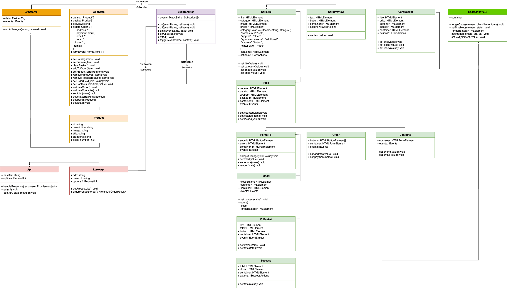

# Проектная работа «Веб-ларек»

Интернет-магазин для практики работы с TS и ООП, в котором можно оформить заказ.

## Используемые технологии:

- HTML
- SCSS
- TS
- Webpack
- ООП

## Установка и запуск проекта

1. npm i
2. npm run start

## UML-схема

